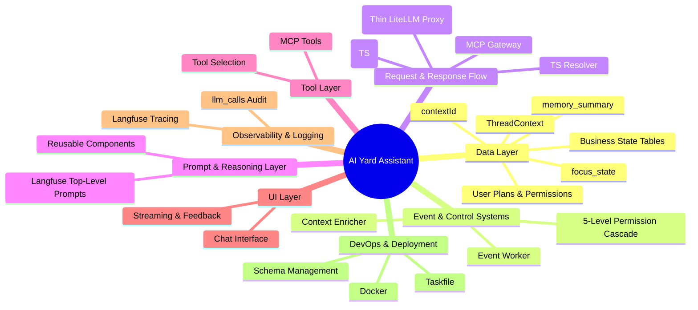

# architecture.md
**Version:** April 20, 2026  
**Status:** Current Single Source of Truth (Zoom Level 1)

This is the highest-level entry point for the AI Yard Assistant system.  
All documentation follows a strict hierarchical zoom model. Start here at Zoom Level 1, then drill down into Zoom Level 2 subsystems and beyond. All files live in the same directory and use lowercase filenames with `.md` extension.

## Core Philosophy

The AI Yard Assistant is a **hybrid conversational + event-driven agent** optimized for salvage yard operations (auction intelligence, real-time inventory visibility, aging and profitability insights, and proactive alerts).

Key design principles:
- Hard enforcement (features, quotas, safety, pricing) happens **before** any LLM call.
- Soft awareness and proactivity come from structured event injection and prompt enrichment.
- `contextId` is the primary conversation identifier.
- ThreadContext is a lightweight, cache-friendly runtime snapshot containing `focus_state`, `pivot_detected`, `memory_summary`, resolved `user_plan`, and active session pointers.
- Full conversation history and detailed business state live in Postgres.
- Focus, pivot, memory, and ThreadContext are first-class citizens that drive reasoning, prompt selection, and tool usage.
- Minimal token usage via dynamic prompt assembly and selective tool injection.
- Unified observability via Langfuse using `contextId` as the session identifier.
- Deliberately modular foundation with light adoption of A2A patterns for structured events and messages, while keeping the core system simple.
- Reuse of mature standards (MCP for tools) and infrastructure (LiteLLM proxy, Langfuse).

**Note on identifiers**: We have adopted `contextId` as the primary top-level identifier. Existing references to `thread_id` will be updated as we build each subsystem. We will lightly adopt A2A patterns (especially message and artifact shapes) where they add clarity without adding complexity.

## High-Level Architecture (Zoom Level 1)

## Major Subsystems (Zoom Level 2)

- [data-layer.md](./data-layer.md) – Storage design including `contextId`, conversation messages, ThreadContext, the full `recycleai` business schema (vehicles, parts, auctions, market data, taxonomy), user plans & permissions, usage tracking, and relationships between conversations and business entities.
- [tool-layer.md](./tool-layer.md) – MCP-based tool definitions, schemas, discovery, and execution.
- [event-control.md](./event-control.md) – Event Worker for external systems, Context Enricher middleware, 5-level permission cascade, and proactive injection path.
- [request-flow.md](./request-flow.md) – Full request pipeline from Chat Transport through TS Resolver to aiproxy (thin LiteLLM + MCP).
- [prompt-management.md](./prompt-management.md) – Langfuse-based top-level prompts per focus_state, reusable components, and TS-side assembly.
- [ui-layer.md](./ui-layer.md) – Chat interface, streaming responses, user feedback, and UI state management.
- [observability.md](./observability.md) – Unified Langfuse tracing, enrichment, and llm_calls audit table.
- [devops-deployment.md](./devops-deployment.md) – Taskfile, Docker, schema management, and deployment standards.
- [future-evolution.md](./future-evolution.md) – Planned decomposition into SME agents, A2A integration, and long-term extensibility.

## Key Flows (High-Level)

**User-Driven Turn**  
User message → Chat Transport → Context Enricher → TS Resolver (prompt selection + assembly + MCP tool selection) → aiproxy → LLM → response + Langfuse trace.

**Proactive Event Turn**  
External system → Event Worker → update business state + inject structured system message (A2A-inspired shape) → optional forced assistant turn using the same TS resolver + aiproxy path.

External systems integrate primarily through the Event Worker (for events) and MCP Tools (for on-demand data). This keeps the primary agent focused and lightweight.

## Non-Functional Goals

- High token efficiency and prompt caching
- Hard safety & quota enforcement before LLM
- Full auditability and reproducibility in Langfuse
- Easy maintenance and LiteLLM upgrades
- Clean separation of concerns (TS for intelligence, aiproxy for infrastructure)
- Scalable path to multi-agent SME decomposition with light A2A adoption

---

**Navigation Rule**  
Always start at architecture.md.  
Choose any subsystem file above to move to Zoom Level 2.  
We will build each Zoom Level 2 file one by one.

**Related high-level documents:**
- [user-stories.md](./user-stories.md)
- [business-model.md](./business-model.md)
