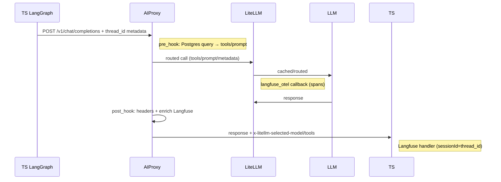

# AIProxy, Logging & Tracing

**Status**: Implemented April 2026. Single source of truth for observability.

AIProxy is the thin Python LiteLLM proxy wrapper ([[architecture.md]] §3.2). Logging/tracing uses self-hosted [[Langfuse v3]] for unified TS LangGraph + proxy spans (no LangSmith).

## What is AIProxy?
- **Purpose**: Dynamic tool injection + prompt assembly from Postgres thread state ([[conversation_threads]]). Reduces tokens (minimal tools/prompts), enables caching, unifies traces.
- **Not a fork**: Hooks + config on LiteLLM proxy (easy upgrades).
- **Serve**: `task aiproxy:install && task aiproxy:start` (:4000).
- **Files**: `aiproxy/` (pyproject.toml, hooks.py, etc., see [[aiproxy/README.md]]).

**Flow** (Mermaid):


## Postgres Tables (logging-impl/schema.sql)
Applied: `task schema:apply`

| Table | Purpose | Usage |
|-------|---------|-------|
| `conversation_threads` | Thread state (focus/pivot/summary) | pre_hook queries for tools/prompt |
| `llm_calls` | Audit log (cost/tools/trace_url) | post_hook inserts for debugging |

Schema snippet:
```sql
CREATE TABLE conversation_threads (
  thread_id UUID PRIMARY KEY,
  checkpoints JSONB,
  focus_state TEXT,  -- drives tool_selector
  pivot_detected BOOLEAN,
  ...
);
```

## Langfuse Integration
- **Unified**: `session_id = thread_id` (TS handler + LiteLLM langfuse_otel).
- **Enrichment**: cost/cache/tools/prompt_version via hooks/enricher.
- **UI**: localhost:3000 (task langfuse:start).
- **Pull/Analyze**: `python logging-impl/pull-trace.py` (JSON/MD to traces/).

**TS Example** (`web/langfuse-handler.ts`):
```ts
const llm = new ChatOpenAI({
  baseUrl: 'http://localhost:4000/v1',
  extraBody: { metadata: { thread_id } },
  callbacks: [langfuseHandler],
});
```

**Taskfile Quickstart**:
```
task langfuse:start
task schema:apply
task aiproxy:install
task aiproxy:start
open http://localhost:3000  # Traces UI
```

## Related
- [[architecture]] (hooks details)
- [[Observability & Tracing]] (high-level)
- [[LangGraph Orchestration]] (thread_id usage)
- [[db-schema]] (business tables)
- [[Home]] (MOC)