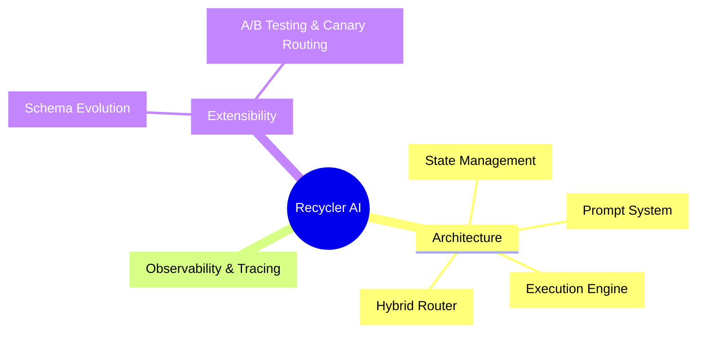

# Welcome to Recycle AI Documentation

This vault contains all necessary documentation for Recycle AI, structured in an interconnected graph format. **Single entry point**: Always start here. Use descriptive [[wikilinks]] to navigate.

## Project Overview
Recycler AI is a modular AI agent system with explicit state management (Zod schemas), hybrid routing, LangGraph orchestration, and extensible prompts. Current skeleton is placeholder; aspirational architecture includes full layers.

## Documentation Structure
### Current Structure
1. `app/layout.tsx`: Root layout for the Next.js application.
2. `app/page.tsx`: Main home page component.
3. `app/api/chat/route.ts`: API route for chat functionality using Vercel AI SDK.

### Aspirational Architecture

## Main Topic Nodes
- [[UI Layer]]
- [[Prompt System]]
- [[Chat Transport]]
- [[Tool Layer]]
- [[Agent State]]
- [[LangGraph Orchestration]]
- [[Hybrid Prompt Router]]
- [[Observability & Tracing]]
- [[AIProxy-Logging-Tracing]]
- [[DevOps & Deployment]]

## Business & Product
- [[user-stories]] - Ranked user stories, salvage yard research, innovative features, and success metrics
- [[business-model]]
- [[db-proposal]]
- [[db-schema]] - RecycleAI database schema and key relationships

## Usage Guide for Agents
Follow [[wikilinks]] for graph navigation. Links optimized for Obsidian graph view.