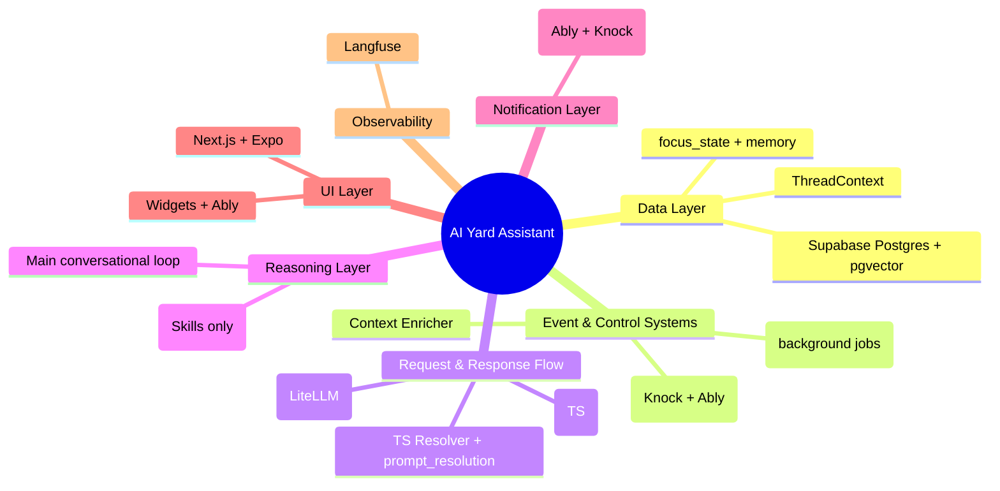

# architecture.md
**Version:** April 25, 2026  
**Status:** Updated (Zoom Level 1) — Phase 0 Scope Applied

This is the highest-level entry point for the AI Yard Assistant system. All documentation follows a strict hierarchical zoom model.

## Core Philosophy

The AI Yard Assistant is a **hybrid conversational + event-driven agent** optimized for salvage yard operations, with a strong focus on **inventory intelligence, valuation, pricing recommendations, and aging inventory insights** in Phase 0.

Key design principles:
- Hard enforcement (features, quotas, safety, canonical IDs) happens **before** any LLM call.
- `contextId` is the primary conversation identifier.
- `ThreadContext` is a lightweight, cache-friendly runtime snapshot.
- Memory, events, and notifications are first-class citizens.
- Mature tools (Supabase, Inngest, Knock, Ably, LangGraph) are used as high-quality implementation details under our core architecture.
- Excellent observability via Langfuse.
- Clean separation between control plane and reasoning plane.

## Current Target Scope (Phase 0)

**Focus Areas:**
- Inventory Intelligence & Valuation
- Pricing Recommendations
- Aging Inventory Detection & Actions
- Profitability Insights
- Strong conversational agent with focus_state awareness
- Proactive internal alerts and notifications
- HITL for high-impact decisions

**Explicitly Out of Scope for Phase 0:**
- Photo intake / computer vision
- Live Copart / IAAI auction integrations
- Advanced external event complexity

## High-Level Architecture

## Major Subsystems (Zoom Level 2)

- [data-layer.md](./data-layer.md) – Supabase Postgres as primary database
- [notification-strategy.md](./notification-strategy.md) – Knock + Ably hybrid routing
- [external-event-controller.md](./external-event-controller.md) – Inngest, events, proactive behavior
- [request-flow.md](./request-flow.md) – Full request pipeline
- [prompt-management.md](./prompt-management.md) – Prompt resolution
- [tool-layer.md](./tool-layer.md) – MCP tools + LangGraph Skills
- [ui-layer.md](./ui-layer.md) – Web + Mobile + Widgets
- [memory-management.md](./memory-management.md)
- [observability.md](./observability.md)
- [development-env.md](./development-env.md)

## Key Technology Decisions

- **Database**: Supabase Postgres + pgvector
- **Realtime**: Ably (not Supabase Realtime)
- **Background Jobs**: Inngest (long-term commitment)
- **Notifications**: Knock (primary) + Ably (simple updates)
- **Skills**: LangGraph (encapsulated)
- **Main Agent**: Custom TS Resolver + `prompt_resolution`
- **Local Auth**: DevAuthService with clean abstraction
- **Production Auth**: Supabase Auth (with abstraction layer)

This architecture gives us excellent velocity in Phase 0 while maintaining long-term coherence and elegance.