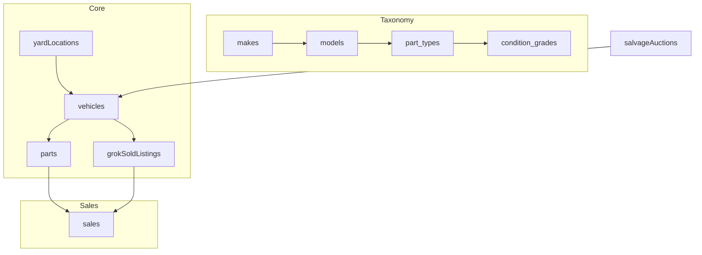

# RecycleAI Database Schema

**Last Updated:** April 13, 2026  
**Schema Location**: [db/schema.sql](db/schema.sql) — the single source of truth for DDL. Run with `psql -h localhost -p 5432 -U car -d ai -f db/schema.sql`.

This document describes the **normalized `recycleai` schema** designed in Phase 0 of [db-todo.md](db-todo.md). It models real-world salvage yard operations with clear "instance" semantics:

- **Car instance** = specific vehicle bought at auction, living in a yard (`vehicles`).
- **Part instance** = specific part extracted from a car instance, with location (`parts`).
- **Market data** = unified comps for pricing intelligence (`grok_sold_listings` — 200 profiles total).

The schema supports all [user stories](user-stories.md) including auction valuation, inventory visibility, aging reports, location lookup, and profitability analysis.

## Key Relationships

### Core Flow: Yard → Vehicle → Part → Sale

1. **Yard** owns **Vehicles** (FK `vehicles.yard_id`).
2. **Vehicles** yield **Parts** (FK `parts.vehicle_id` — **critical relationship**).
3. **Parts** have **Location** (FK `parts.location_id → yard_locations`).
4. **Parts** generate **Sales** (FK `sales.part_id`).
5. **GrokSoldListings** provides market comps (FKs to taxonomy for pricing intelligence).

### 200-Profile Market Data

- `grok_sold_listings` contains **99 real paid records** (`data_source = 'paid_ebay'`) + **~101 synthesized research records** (`data_source = 'synthesized_research'`).
- Supports auction valuation ("part-out value") and dynamic pricing.

## Table Summary

| Table                            | Purpose                | Key FKs                                                           | Indexes                                                   |
| -------------------------------- | ---------------------- | ----------------------------------------------------------------- | --------------------------------------------------------- |
| `makes`, `models`                | Vehicle taxonomy       | -                                                                 | `name`                                                    |
| `part_types`, `condition_grades` | Part taxonomy          | -                                                                 | `part_key`, `grade_key`                                   |
| `vehicles`                       | Car instances          | `make_id`, `model_id`, `yard_id`                                  | `make_id, model_id, year, status`                         |
| `parts`                          | Part instances         | `vehicle_id`, `part_type_id`, `condition_grade_id`, `location_id` | `vehicle_id, location_id, acquired_date, status`          |
| `grok_sold_listings`             | Market comps           | `make_id`, `model_id`, `part_type_id`                             | `make_id, model_id, part_type_id, date_sold, data_source` |
| `yard_locations`                 | Physical locations     | `yard_id`                                                         | `row_code, bay, shelf`                                    |
| `sales`                          | Sales history          | `part_id`, `vehicle_id`, `part_type_id`                           | `sold_date, part_type_id`                                 |
| `salvage_auctions`               | Upcoming opportunities | `make_id`, `model_id`                                             | `auction_date, status`                                    |

## Supporting Objects

- **Views**: `vehicle_inventory_summary` (counts/valuation by vehicle).
- **Functions**: Planned for part-out valuation, aging calculations.

## Data Strategy

- **200 profiles total**: 99 real + 101 synthesized (statistical pattern transfer from real data + public research).
- **Realism**: 8–15 parts per vehicle, 65–91 day average turnover with long tail, pricing aligned with market comps.

See [db-proposal.md](db-proposal.md) for augmentation details and [user-stories.md](user-stories.md) for supported queries.

## AI Logging Tables ([[AIProxy-Logging-Tracing]])
- `conversation_threads`: Thread state for dynamic proxy tools/prompts.
- `llm_calls`: LLM call audit (cost/tools/traces).

Apply schema: `task schema:apply` (`logging-impl/schema.sql`).

**Links**:

- [[db-todo]] (master checklist)
- [[db-proposal]] (design rationale)
- [[user-stories]] (business requirements)
- [[Home]] (documentation overview)