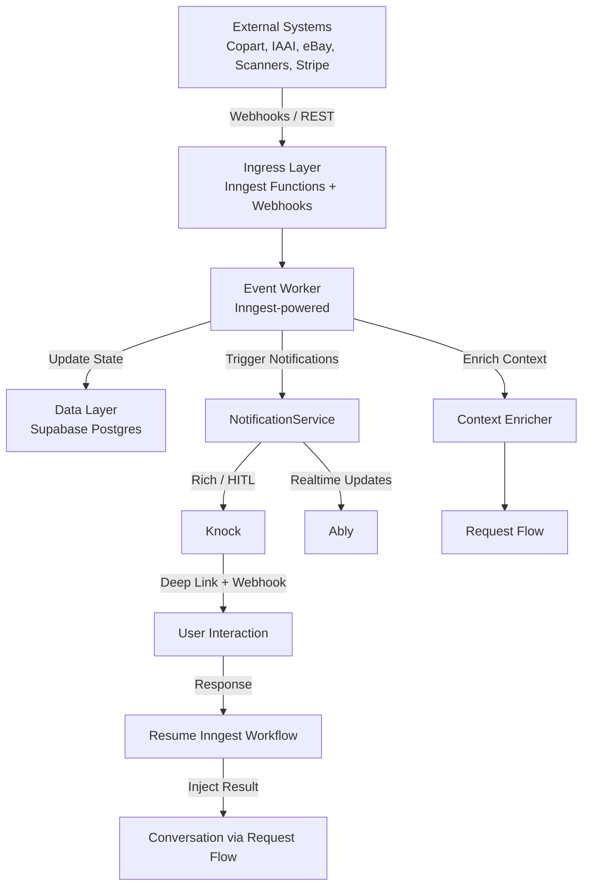

# external-system-integration.md
**Version:** April 25, 2026  
**Status:** Updated (Zoom Level 2) — Inngest + Knock + Ably

This document defines the architecture for how the AI Yard Assistant interacts with external systems. It covers ingress (data coming in), egress (data going out), event processing, and the decision framework for when to persist data versus stream it in real time.

## Purpose of External System Integration

The AI Yard Assistant must reliably exchange data with many external systems, including:

- Auction platforms (Copart, IAAI — deferred in Phase 0)
- Inventory scanners and location systems
- Market data providers (eBay, pricing APIs — market data already ingested and indexed)
- Billing systems (Stripe)
- Notification channels (email, SMS, push via Knock)
- Future SME agents and partner systems

This document establishes a clean, scalable, and observable architecture that supports multiple ingress patterns (REST, webhooks, Inngest workflows) while maintaining control, auditability, and performance. In Phase 0 we focus on internal market data and proactive behavior rather than live external auction integrations.

## Core Principles

1. **Single Event Bus via Inngest** — All external and internal events eventually flow through Inngest for durable, observable execution.
2. **Decoupled Ingress & Egress** — External systems should not need to know about internal widgets, real-time channels, or business logic.
3. **Intelligent Hybrid Routing** — The system decides whether to save to Supabase, push to Ably (realtime), trigger Knock notifications, or start Inngest workflows.
4. **Full Observability** — Every ingress and egress event is traced with `contextId` across Inngest, Knock, Langfuse, Ably, and Supabase.
5. **Security & Governance** — All external interactions are gated by `effective_features` and properly authenticated.
6. **Extensibility** — New external systems and integration patterns can be added without major architectural changes.

## Architecture Overview

We use a layered, event-driven architecture centered around **Inngest** as the durable execution engine, **Knock** for rich notifications, and **Ably** for realtime updates.

**Key Components:**

- **Inngest** — Central durable execution platform for all background jobs, HITL workflows, retries, and long-running processes.
- **Event Worker** — Inngest functions that process incoming events, update state, and decide routing.
- **NotificationService** — Central abstraction that routes to Knock (rich/HITL) or Ably (realtime updates).
- **Context Enricher** — Updates `ThreadContext` with new external data before any LLM call.
- **Knock** — Primary platform for rich, actionable, multi-channel notifications and closed-loop HITL.
- **Ably** — Realtime platform for low-latency widget updates, badge counts, and simple state synchronization.

## Inngest Integration

**Inngest** is the backbone of all background and asynchronous work in the system.

**Usage Patterns:**
- All webhook handlers and cron jobs are implemented as Inngest functions.
- Long-running jobs (report generation, bulk valuation, data sync) run as Inngest workflows with built-in retries and observability.
- HITL steps are implemented as Inngest “wait for event” steps that pause until user response arrives via deep link or webhook.
- Event Worker logic lives inside Inngest functions for durability and replayability.

**Benefits in Phase 0:**
- Reliable retries for external API calls
- Built-in observability and replay
- Easy local development with Inngest Dev Server
- Future-proof for complex multi-step workflows when we add live auction integrations

## Knock Integration

**Knock** handles all rich, actionable, and multi-channel notifications.

**Key Capabilities Used:**
- Workflow-based notification templates
- User preference engine (channels, quiet hours, importance thresholds)
- Deep link + signed webhook support for closed-loop HITL
- In-app notification center components
- Delivery tracking and analytics

**Integration Point:**
The `NotificationService` (in `packages/shared/notifications`) is the single point of entry. It decides whether to call Knock or route realtime updates to Ably.

## Hybrid Routing Strategy

We use a deliberate **hybrid routing** model to balance cost, latency, and user experience:

| Use Case                              | Routing     | Reason |
|---------------------------------------|-------------|--------|
| Widget state, badge counts, simple `ThreadContext` changes | Ably        | Low latency, excellent developer experience |
| Rich notifications, HITL approvals, multi-channel (push/email/SMS) | Knock       | Full feature set + excellent UX |
| High-importance external events       | Knock (priority) | Guaranteed delivery + tracking |
| Long-running job completion           | Knock       | Rich payload + deep link to results |

**Routing Decision Logic** lives in `NotificationService.send(...)` and considers:
- `importance_score`
- Whether user action is required
- User notification preferences
- Current `focus_state`

## Event Processing Flow

1. External system sends webhook / event (or internal cron fires)
2. Inngest function receives the event
3. Event Worker validates, normalizes, and updates relevant Supabase tables
4. Context Enricher is triggered (if user is in an active session)
5. NotificationService decides routing (Knock vs Ably)
6. If Knock is used → rich notification with deep link is sent
7. If Ably is used → realtime update is pushed to connected clients
8. If user responds via deep link → Inngest workflow resumes
9. Result is injected into the conversation via normal Request Flow
10. Full trace is recorded in Langfuse under the same `contextId`

## Phase 0 Scope

**Implemented in Phase 0:**
- Internal market data (already in Supabase, indexed)
- Aging inventory alerts and profitability insights
- Proactive notifications via Knock + Ably
- HITL for high-impact decisions (bidding limits, pricing changes)
- Full Inngest + Knock + Ably integration

**Deferred (Future):**
- Live Copart / IAAI webhook integrations
- Real-time auction bidding via external APIs
- Photo intake computer vision pipelines

## Observability

Every external event and integration point is fully traceable:

- Inngest traces linked to `contextId`
- Knock delivery status (sent, delivered, clicked, responded) logged
- Ably connection and message events captured in Langfuse
- All decision points (`decision` / `reason` / `input` / `output`) recorded

This gives us complete visibility from external webhook → user action → conversation injection.

## Security & Governance

- All incoming webhooks are validated with signatures where available.
- Outbound calls (Stripe, future auction APIs) use scoped credentials.
- Every external interaction is gated by `effective_features`.
- Sensitive data is redacted before being passed to notifications or logs.
- Full audit trail is maintained in Langfuse for compliance and debugging.

## Extensibility

The architecture is designed to easily accommodate new external systems:

- New Inngest functions can be added for new webhook types.
- New Knock templates and workflows can be created without code changes.
- The `NotificationService` abstraction allows swapping or adding new realtime providers (Ably, Pusher, self-hosted, etc.).
- Future SME agents will be able to publish and subscribe to the same event bus.

This keeps the system maintainable as we grow from Phase 0 into full multi-agent operation.