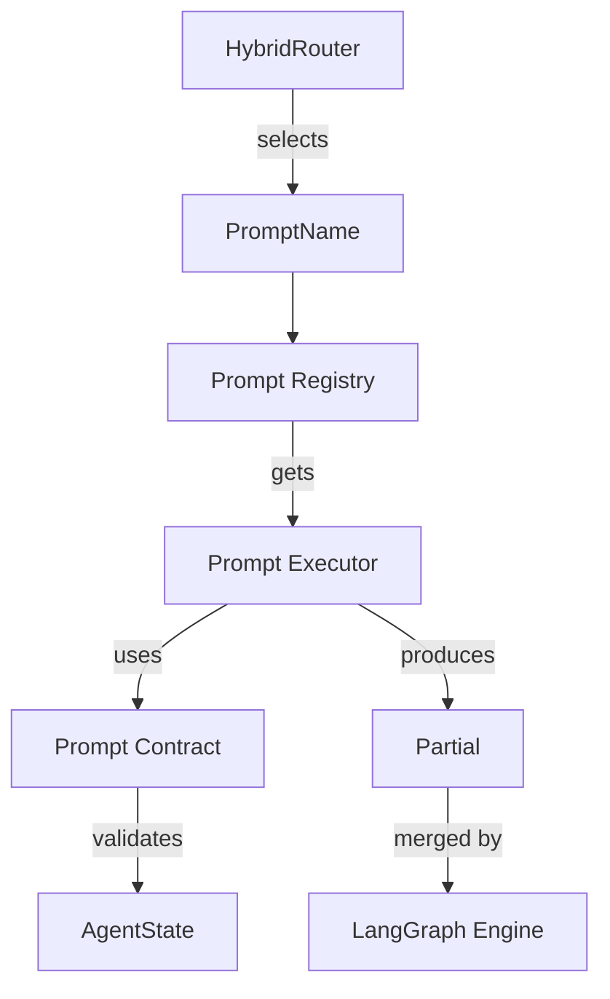

# Prompt System

This module implements the **modular, contract-driven Prompt System** for Recycler AI. It provides a registry of versioned prompts, each with a strict Zod schema contract, a pure executor function, and test vectors.

## Documentation Entry Point

Always start documentation lookups from:
- [`new-docs/00 - Maps of Content/Recycler AI Overview.md`](../../new-docs/00%20-%20Maps%20of%20Content/Recycler%20AI%20Overview.md)

Key related docs:
- [`docs/Prompt-System.md`](../../new-docs/04%20-%20Permanent/Architecture/Prompt%20System.md)
- [`docs/Hybrid-Prompt-Router.md`](../../new-docs/04%20-%20Permanent/Router/Overview.md)
- [`docs/LangGraph-Orchestration.md`](../../new-docs/04%20-%20Permanent/Architecture/Execution%20Engine.md)
- [`new-docs/04 - Permanent/Extensibility/Hybrid Router Extensions.md`](../../new-docs/04%20-%20Permanent/Extensibility/Hybrid%20Router%20Extensions.md)

## Architecture

The Prompt System integrates directly with the Hybrid Router and the AgentState. The router selects a `PromptName`, and the registry provides the corresponding executor to be run by the LangGraph engine.



## Usage

### Getting a Prompt Executor

The primary interface is the `getPromptExecutor` function, which retrieves a ready-to-run prompt function from the registry.

```typescript
import { getPromptExecutor } from '@prompts/registry';
import { createInitialState } from '@state/schema';

const state = createInitialState();
const classifyIntent = getPromptExecutor('classify_intent', 'v1');

// Execute the prompt
const stateUpdate = await classifyIntent(state);

// The result is a partial state to be merged
console.log(stateUpdate.context.intent);
```

### Prompt Contracts

Each prompt is defined by a `PromptContract` in `lib/prompts/v1/`. This contract includes:
- `name` and `version`.
- `inputSchema` and `outputSchema` (Zod).
- `deriveInput`: A pure function to create the prompt's input from `AgentState`.
- `mergeOutput`: A pure function to merge the prompt's output into a new `Partial<AgentState>`.
- `template`: The prompt text.
- `testVectors`: For validation.

### Creating a New Prompt

1.  Define a `*.contract.ts` file in `lib/prompts/v1/`.
2.  Implement the `PromptContract` interface.
3.  Register the new contract in `lib/prompts/registry.ts`.

## Integration with LangGraph

In a LangGraph node, you would use the executor like this:

```typescript
import { getPromptExecutor } from '@prompts';
import { StateGraph } from '@langchain/langgraph';
import { AgentStateSchema } from '@state/schema';

const graph = new StateGraph(AgentStateSchema);

graph.addNode('classify_intent', async (state) => {
  const classify = getPromptExecutor('classify_intent');
  const update = await classify(state);
  // Merge the partial update into the full state
  return { ...state, ...update, context: { ...state.context, ...update.context } };
});
```

## Testing

Run `npm test` to execute the test suite for the prompt registry, contracts, and executors.