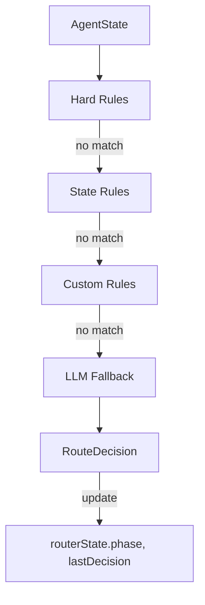

# Hybrid Router

The **Hybrid Router** is the decision‑making core of the Recycler AI system. It implements the 3‑phase routing architecture defined in the documentation graph:

1. **Hard Rules** (deterministic safety gates)
2. **State‑Based Decisions** (workflow sequencing)
3. **LLM Fallback** (ambiguity resolution)

## Documentation Entry Point

Always start documentation lookups from:
- [`new-docs/00 - Maps of Content/Recycler AI Overview.md`](../../new-docs/00%20-%20Maps%20of%20Content/Recycler%20AI%20Overview.md)

Key related docs:
- [`new-docs/04 - Permanent/Router/Overview.md`](../../new-docs/04%20-%20Permanent/Router/Overview.md)
- [`new-docs/04 - Permanent/Extensibility/Hybrid Router Extensions.md`](../../new-docs/04%20-%20Permanent/Extensibility/Hybrid%20Router%20Extensions.md)
- [`new-docs/04 - Permanent/Architecture/Prompt System.md`](../../new-docs/04%20-%20Permanent/Architecture/Prompt%20System.md)

## Architecture

The router consumes the **AgentState** (defined in [`../state/schema.ts`](../state/schema.ts)) and produces a **RouteDecision** that drives the next step in the LangGraph execution engine.



## Usage

### Basic Routing

```typescript
import { HybridRouter } from '@router/hybrid';
import { createInitialState } from '@state/schema';

const router = HybridRouter.create();
const state = createInitialState();

// Add custom rules (extensibility)
router.registerCustomRule((state) => {
  if (state.context.myFlag === true) {
    return {
      nextPrompt: 'respond',
      source: 'state_based',
      reason: 'Custom rule matched',
    };
  }
  return null;
});

const decision = await router.selectNextPrompt(state);
console.log(decision);
// {
//   nextPrompt: 'classify_intent',
//   source: 'llm_fallback',
//   reason: 'LLM fallback: ...',
//   timestamp: '2026-04-12T...'
// }
```

### Configuration

```typescript
const router = HybridRouter.create({
  enableLLMFallback: true,
  proxyBaseURL: 'http://localhost:3000', // OpenRouter proxy
  llmModel: 'openai/gpt-4o',
  llmMinConfidence: 0.7,
});
```

### Integration with LangGraph

The router is designed to be used inside LangGraph nodes to drive conditional logic. The selected `PromptName` from the `RouteDecision` determines which prompt executor to run next.

```typescript
import { StateGraph } from '@langchain/langgraph';
import { AgentStateSchema } from '@state/schema';
import { HybridRouter } from '@router/hybrid';
import { getPromptExecutor } from '@prompts/registry';

const router = HybridRouter.create();

const graph = new StateGraph(AgentStateSchema)
  .addNode('route', async (state) => {
    const decision = await router.selectNextPrompt(state);
    // The decision is now available for conditional edges
    return { ...state, routerDecision: decision };
  })
  // Example conditional edge
  .addConditionalEdges('route', (state) => state.routerDecision.nextPrompt);

// Each prompt has its own node
graph.addNode('classify_intent', async (state) => {
  const classify = getPromptExecutor('classify_intent');
  const update = await classify(state);
  return { ...state, ...update, context: { ...state.context, ...update.context } };
});
```

## Extensibility

Follow the patterns in [`new-docs/04 - Permanent/Extensibility/Hybrid Router Extensions.md`](../../new-docs/04%20-%20Permanent/Extensibility/Hybrid%20Router%20Extensions.md):

- **Hard Rules**: `router.registerHardRule(rule)`
- **State Rules**: `router.registerStateRule(rule)`
- **Custom Rules**: `router.registerCustomRule(rule)`

Rules are plain functions `(state: AgentState) => RouteDecision | null`.

## Observability

Every decision updates `routerState`:
- `phase`: `'hard-rule'`, `'state-based'`, or `'llm-fallback'`
- `lastDecision`: `{ ruleId, confidence, timestamp }`

These fields are traced via OpenTelemetry/LangSmith (future integration).

## Testing

Run `npm test` to execute the comprehensive test suite covering all routing phases, edge cases, and extensibility.

## Next Steps (Completed)

✅ **Prompt System** (modular prompts referenced by `PromptName`)
✅ **LangGraph Execution Engine** (orchestrates router + prompts)

## Next
- **Chat Transport** (Vercel AI SDK + streaming)
- **UI Layer** (projects state + integrates with router decisions)