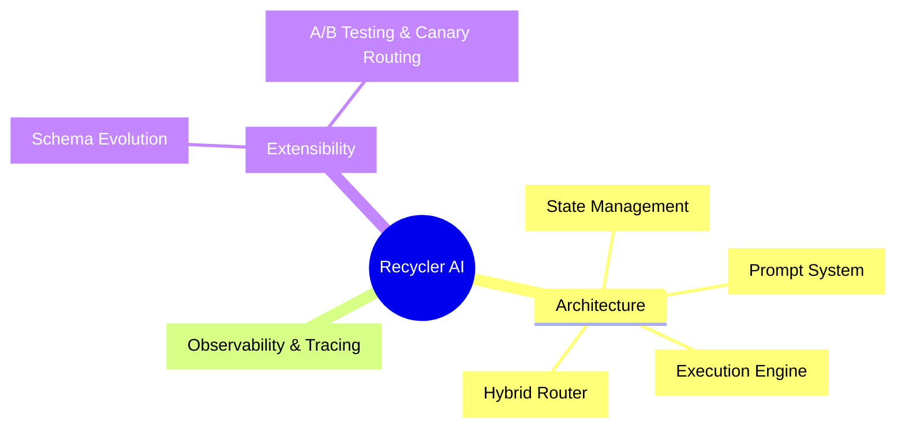

# Recycler AI Overview

Welcome to the Recycler AI Obsidian Vault. This is the **single entry point** for navigating the documentation. Always start here. Use only the descriptive wikilinks below.

## Project Overview
Recycler AI is designed to function as a modular and robust system with clear state management, a sophisticated prompt system, and extensive documentation.

## Documentation Structure

### Current Skeleton (Depot)

The current implementation is a placeholder stage and does not fully reflect the intended architecture or codebase consistency. Here are the critical notes:

1. **`apps/web/index.tsx`**: Basic front UI with a placeholder for a chat interface.
2. **`apps/api/healthz.ts`**: A simple API handler for health checking, not part of a cohesive Next.js structure.
3. **`openrouter-proxy.js`**: Server script without integrated Next.js handler paths.

### Aspirational Architecture (Future Goals)

**Aiming to implement:** 
- **AgentState**, **PromptSystem**, **HybridRouter**, and corresponding integration layers written in TypeScript.
- For every key layer and functionality, provide a migration plan from the current skeleton to the fully functional architecture.

## Links to Key Sections
- [[Architecture Overview|Comprehensive overview of all architecture layers and their relationships]]`
- [[State Management|Core foundation defining AgentState with Zod schemas]]`
- [[Prompt System|Modular prompting with hybrid routing logic]]`
- [[Execution Engine|LangGraph-based workflow execution and state transitions]]`
- [[Hybrid Router Extensions|Custom rules, A/B testing, and router extensibility patterns]]`
- [[State Schema Evolution|Versioning, migration functions, and checkpoint compatibility]]`

## Usage Guide for Agents
Follow the links to access different sections. Always start here to navigate the entire documentation effectively.