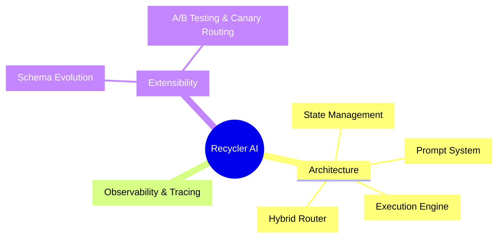

<docs_cache>
<instruction>
Cached Recycler AI docs for Grok 4.20 planning. Single entry: Home.md. Use template, [[wikilinks]], Implementation Details. Stable - do not modify. Saves tokens.
</instruction>

<doc name="Agent-State.md">---
title: Agent State Documentation
tags: [obsidian, recycle-ai, agent-state]
published: true
---

# Agent State Overview

The Agent State layer serves as the **single source of truth** for all reasoning processes. Explicit, schema-based, extensible with Zod/TS.

## Purpose
Defines and manages explicit agent state using Zod schemas and TypeScript types. State is the source of truth, not prompts.

## Key Concepts
- State is the source of truth, not prompts.
- Utilizes Zod schemas for type enforcement.

## Explicit Implementation Requirements
### 1. Define AgentState Type/Schema
- Use TypeScript for type definition and Zod for runtime validation. Avoid catch-all structures.

### 2. Organizational Standards
- Keys versioned, grouped logically.

### 3. Schema Example
```typescript
import { z } from "zod";

export const AgentStateSchema = z.object({
  messages: z.array(z.object({
    sender: z.enum(["user", "assistant", "tool"]),
    content: z.string(),
    timestamp: z.string(),
    id: z.string().optional(),
  })),
  threadId: z.string(),
  focus: z.string().nullable(),
  currentPlan: z.string().nullable(),
  memory: z.object({
    workingMemory: z.any().optional(),
    userProfile: z.any().optional(),
    derivedMemory: z.any().optional(),
  }),
  pivotSignals: z.object({
    pivotDetected: z.boolean(),
    pivotType: z.enum(["hard", "soft", "none"]).optional(),
    focusTopic: z.string().optional(),
  }).optional(),
  pendingToolCalls: z.array(z.string()),
  toolResults: z.array(z.any()),
  requiresApproval: z.boolean(),
  lastError: z.string().nullable(),
  retryCount: z.number().default(0),
  uiArtifacts: z.any().optional(),
  sessionContext: z.record(z.any()).optional(),
  readyToRespond: z.boolean().default(false),
  waitingForUser: z.boolean().default(false)
});
export type AgentState = z.infer<typeof AgentStateSchema>;
```

## Good Practices
- Each field relevant to prompts/tools/workflow.
- Testing for valid/invalid states.

## Related Topics
- [[Prompt System]]
- [[Hybrid Prompt Router]]
- [[State Schema Evolution]]</doc>
<doc name="Chat-Transport.md">---

title: Chat Transport Documentation
tags: [obsidian, recycle-ai, chat-transport]
published: true
---

# Chat Transport Overview

The Chat Transport node serves as the entry and exit point for all real-time user and agent interactions. This system mediates the flow of conversation while providing a structured, efficient approach to user message handling.

## Purpose
This component is responsible for:
- Receiving user input, including messages and metadata.
- Forwarding input to the agent, processing through orchestration.
- Streaming responses back to the user while maintaining session integrity.

## Explicit Implementation Requirements
### 1. API Route Setup
- Implement the Chat Transport using Next.js API routes (for example, `/api/chat`).
- Use a POST method for the primary chat flow and optionally GET for event stream initialization.
- Ensure all payloads conform to the expected structure ({ message, threadId, etc.}) based on AgentState contracts.

### 2. Streaming Setup & Protocol
- Establish outbound streams that support real-time interaction (Server-Sent Events, WebSockets).
- Partial/responsive outputs should be reflected back to the UI frequently.

### 3. Workflow Integration
- Validate and authenticate user sessions before processing messages.
- Utilize state management for contextual continuity in conversations.

### 4. Error Handling
- Implement robust mechanisms to catch and report errors systematically.
- Standardize error response formats for clarity.

### 5. Logging, Trace ID, and Error Handling
- All calls to the API must log essential details for traceability.
- Collect trace IDs and unique identifiers for each session to enable detailed event tracking.

## Related Topics
- For a deeper understanding of modular prompts and their integration with the chat transport, see [[Prompt System]].
- Explore how user interactions are managed and routed in [[Hybrid Prompt Router]].
- For UI elements that manage chat output, check out [[UI Layer]].

---
</doc>
<doc name="Home.md">---
title: Recycle AI Documentation Home
tags: [obsidian, recycle-ai, home]
published: true
aliases: [Overview, MOC]
---

# Welcome to Recycle AI Documentation

This vault contains all necessary documentation for Recycle AI, structured in an interconnected graph format. **Single entry point**: Always start here. Use descriptive [[wikilinks]] to navigate.

## Project Overview
Recycler AI is a modular AI agent system with explicit state management (Zod schemas), hybrid routing, LangGraph orchestration, and extensible prompts. Current skeleton is placeholder; aspirational architecture includes full layers.

## Documentation Structure
### Current Skeleton
1. `apps/web/index.tsx`: Basic UI placeholder.
2. `apps/api/healthz.ts`: Health API.
3. `openrouter-proxy.js`: LLM proxy.

### Aspirational Architecture


## Main Topic Nodes
- [[UI Layer]]
- [[Prompt System]]
- [[Chat Transport]]
- [[Tool Layer]]
- [[Agent State]]
- [[LangGraph Orchestration]]
- [[Hybrid Prompt Router]]
- [[Observability & Tracing]]
- [[DevOps & Deployment]]

## Usage Guide for Agents
Follow [[wikilinks]] for graph navigation. Links optimized for Obsidian graph view.</doc>
<doc name="Hybrid-Prompt-Router.md">---

title: Hybrid Prompt Router Documentation
tags: [obsidian, recycle-ai, hybrid-router]
published: true
---

# Hybrid Prompt Router Overview

The Hybrid Prompt Router is the critical component responsible for controlling the flow of interactions within the agent. It intelligently selects which prompt to execute based on a structured hierarchy of routing rules.

## Purpose
This router ensures that the decisions made by the agent are logical, explainable, and safely managed through:
- Hard rules enforcement for critical workflow interrupts.
- Stateful workflow logic that aligns with the agent's current state.
- An LLM fallback for ambiguous situations.

## Explicit Implementation Requirements
### 1. Router Signature & Inputs
- Export a function:
```typescript
selectNextPrompt(state: AgentState): RouteDecision;
```
- This function MUST take the current `AgentState` as input and return a structured decision object.

### Example Decision Structure
```typescript
type RouteDecision = {
  nextPrompt: PromptName;
  source: "hard_rule" | "state" | "llm";
  reason: string;
  stateSnippet?: Partial<AgentState>;
};
```

### 2. Routing Phases
- **Hard Rules Layer**: Always execute first for must-interrupt scenarios (e.g., user approval).
- **State-Based Workflow Layer**: Evaluate conditions based on the current state and determine next prompts accordingly.
- **LLM Fallback Layer**: Only invoked when hard rules and state logic provide no clear outcome.

### 3. Logging & Traceability
- Every routing decision MUST log the input state, chosen prompt, and reasoning behind that choice for transparent debugging purposes.

### Example Logging
```json
{
  "decision": {
    "nextPrompt": "plan_query",
    "source": "state",
    "reason": "Data query focus and no plan exists"
  }
}
```

## Related Topics
- For insights on how prompts are constructed, see [[Prompt System]].
- For understanding how to manage events and states, refer to [[LangGraph Orchestration]].

---
</doc>
<doc name="LangGraph-Orchestration.md">---
title: LangGraph Orchestration Documentation
tags: [obsidian, recycle-ai, langgraph]
published: true
---

# LangGraph Orchestration Overview

Execution engine for prompt workflows with LangGraph JS.

## Purpose
Orchestrates prompts, state transitions, decision-making.

## Key Concepts
- Graph-based state machine.
- Nodes for prompts/router, conditional edges.

## Implementation Requirements
1. Graph Structure: Nodes (prompts), edges (transitions).
```typescript
import { StateGraph } from '@langchain/langgraph';
const graph = new StateGraph(AgentStateSchema);
graph.addNode('router', routerNode);
graph.addConditionalEdges('router', (state) => state.routerState.lastDecision.ruleId);
```

2. Node Execution: Validate input, execute, update state.
3. State Change Management: Log transitions.
4. Interrupt Handling: interruptBefore('await_user').

## Related Topics
- [[Prompt System]]
- [[Agent State]]
- [[Chat Transport]]</doc>
<doc name="Prompt-System.md">---
title: Prompt System Documentation
tags: [obsidian, recycle-ai, prompt-system]
published: true
---

# Prompt System Overview

Modular, contract-driven prompts with registry. Combines hard rules, state-based, LLM fallback.

## Purpose
Modular prompting and hybrid routing. Each prompt is versioned, contract-governed.

## Key Features
- Modular design.
- Versioned.
- Contract enforcement (input/output Zod).
- Registry structure.

## Prompt Registry Structure
```
prompts/
  v1/
    classify-intent.prompt.md
    classify-intent.contract.ts
    ...
```

## Core Prompts
- classify_intent
- detect_pivot
- update_focus
- plan_next_step
- execute_tool_reasoning
- analyze_results
- respond

## Implementation Requirements
1. Prompt module conventions (text, schemas, version, tests).
2. Input/Output contracts.
3. Test vectors.

## Related Topics
- [[LangGraph Orchestration]]
- [[Hybrid Prompt Router]]
- [[Agent State]]</doc>
<doc name="Tool-Layer.md">---

title: Tool Layer Documentation
tags: [obsidian, recycle-ai, tool-layer]
published: true
---

# Tool Layer Overview

The Tool Layer is integral to the Recycle AI architecture, providing a safe, type-checked interface for the agent to interact with external systems — such as APIs and databases. This layer emphasizes transparency and accountability in tool management and usage.

## Purpose
Tools are registered components within the system, each rigorously defined by contracts that ensure their proper functioning in the workflow.

## Explicit Implementation Requirements
### 1. Tool Definition & Contract
- Each tool MUST be defined as a module, including:
    - `inputSchema` and `outputSchema` to provide type definitions for API interactions.
    - Descriptive versioning to manage updates effectively.

### 2. Tool Registry
- A `toolRegistry.ts` file must aggregate and expose all available tool modules by name and version.
- Ensure that only authorized agent workflows can access specific tools.

#### Example Tool Definition
```typescript
import { z } from "zod";

export const version = "v1";
export const description = "Query the orders database for a user's order status.";
export const inputSchema = z.object({
  userId: z.string(),
  orderId: z.string(),
});
export const outputSchema = z.object({
  status: z.enum(["pending", "shipped", "delivered", "cancelled"]),
  eta: z.string().optional(),
  error: z.string().optional(),
});

export async function queryOrderStatusTool(input: z.infer<typeof inputSchema>) {
  // Your implementation here
  return { status: "shipped", eta: "2026-04-11" };
}
```

### 3. Input/Output Validation
- All tool input/output MUST be validated against defined schemas when called. Use a “fail-closed” approach, rejecting and logging invalid calls.

### 4. Test Vectors & Auditing
- Every tool MUST have:
    - At least one valid input/output test.
    - At least one invalid/misuse test.

## Related Topics
- For understanding the cognitive function modules, see [[Prompt System]].
- For deeper insights on API interactions, refer to [[Chat Transport]].

---
</doc>
<doc name="UI-Layer.md">---

title: UI Layer Documentation
tags: [obsidian, recycle-ai, ui-layer]
published: true
---

# UI Layer Overview

This documentation outlines the structure and requirements for the UI Layer of the Recycle AI application. It establishes the principles that guide user interaction with the agent and includes the handling of conversational outputs.

## Purpose
The UI Layer is designed to drive the user-agent interaction experience and ensure intuitive, stream-aware, and context-rich output presentation.

## Key Features
- **Structure**: Organized components that function in a modular way.
- **Component Conventions**: All components are built using typed contracts and state management.

### 1. Component Structure & Conventions
- Components must be organized by their functional area, such as ChatFeed, MessageInput, and ToolOutputs.
- Types must be derived from agent states and prompt outputs, ensuring type safety.

### 2. Streaming & Reactivity
- The UI must implement Vercel AI SDK’s streaming capabilities to provide real-time updates.
- Intermediate agent events should trigger specific UI states.

### 3. UI Feedback for Interrupts & Approvals
- The UI must visibly indicate when input or approval is awaited, with actionable controls always present.

### 4. Error Handling
- Clear error states should be identifiable and manageable, ensuring users are well-informed.

### 5. Theming & Accessibility
- The design must adopt accessibility standards, offering responsive and themable interfaces for users.

## Related Topics
- For an overview of prompt handling, see [[Prompt System]].
- To learn about the agent's state management, see [[Agent State]].
- For more on the chat transport mechanisms, check [[Chat Transport]].

---
</doc>


<guidance>
For planning: Reference exact sections. Output numbered plan with files, mermaid, edge cases. Use this cache for all future plans.
</guidance>
</docs_cache>